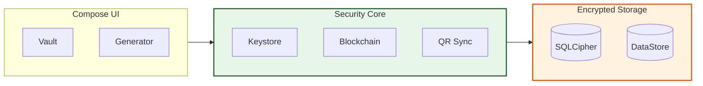

# 🏰 KeyFortress

### *Military-Grade, Offline-First Password Vault & Generator*

KeyFortress is a zero-network, ultra-secure Password Manager built for **Android 15+ (API 35)**. It provides a "Sovereign" security model where the user has 100% ownership of their data with cryptographic proofs of integrity.

---

## 🛡️ Security Highlights

- **🚫 Zero Network**: No `INTERNET` permission. Data never leaves your device.
- **🔐 Double Encryption**: AES-256-GCM (KeyStore) + SQLCipher (Database).
- **🧱 Blockchain Audit Log**: A hardware-signed ledger of every vault action to prevent file-level tampering.
- **📡 Air-Gapped Sync**: Encrypted QR-based transfer between devices using PBKDF2 and AES-GCM.
- **💎 Hardware-Backed**: Master keys are generated and stored in the device's TEE/HSM.
- **🛡️ Screen Protection**: App-wide `FLAG_SECURE` prevents screenshots and screen recording.
- **🛡️ PIN Hardening**: Salted PBKDF2 hashing for Master PIN (100,000 iterations).

---

## ✨ Features

- **🎯 Intelligent Generator**: Passwords, Passphrases (Diceware), and PINs.
- **🗳️ Encrypted Vault**: Full management of credentials, URLs, and secure notes.
- **⏰ TOTP Authenticator**: Built-in 2FA (Google Authenticator style) with encrypted secrets.
- **🔍 Security Audit**: Real-time scan for weak, reused, or expired credentials.
- **🪄 Native Autofill**: Seamless credential entry in apps and websites.
- **📑 Recovery Kit**: Generate a secure PDF "Emergency Kit" with automated cache purging.

---

## 🏗️ Architecture

KeyFortress follows **Clean Architecture** principles with a focus on cryptographic integrity.

> [!NOTE]
> **Architecture Flow Explanation**: This high-level flow shows how **User Interface** actions trigger the **Security Core** to process data before it reaches the **Encrypted Storage**. This ensures that sensitive information is always handled by hardware-backed cryptographic modules before being persisted.

---

## 📚 Documentation

Detailed documentation is available in the [`/docs`](file:///Users/ashwinsingh/Desktop/PasswordGenerator/docs/) directory:

- [🏗️ Architecture Overview](file:///Users/ashwinsingh/Desktop/PasswordGenerator/docs/architecture.md)
- [🛡️ Security Deep-Dive](file:///Users/ashwinsingh/Desktop/PasswordGenerator/docs/security.md)
- [✨ Feature Guide](file:///Users/ashwinsingh/Desktop/PasswordGenerator/docs/features.md)

---

## 🛠️ Getting Started

### Prerequisites
- Android Studio Ladybug (or newer)
- Android 15+ Device/Emulator

### Build & Run
1. Clone the repository.
2. Open in Android Studio.
3. Sync Gradle.
4. Run on your device.

---

## ⚖️ License
KeyFortress is licensed under the MIT License. See [LICENSE](LICENSE) for details.
