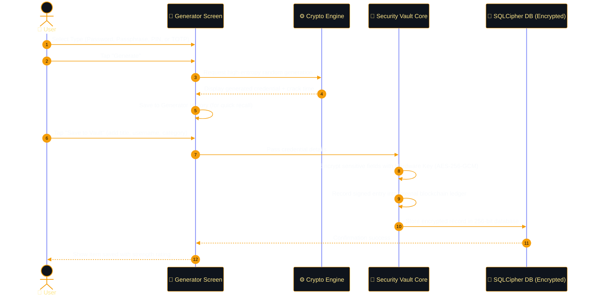
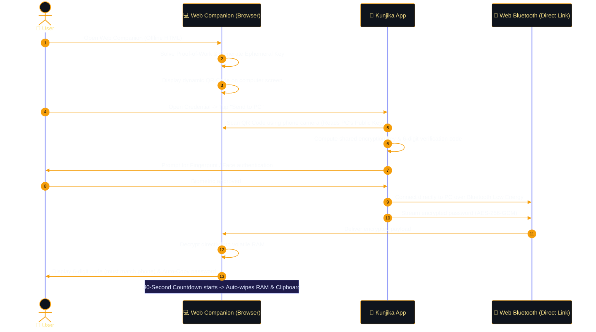
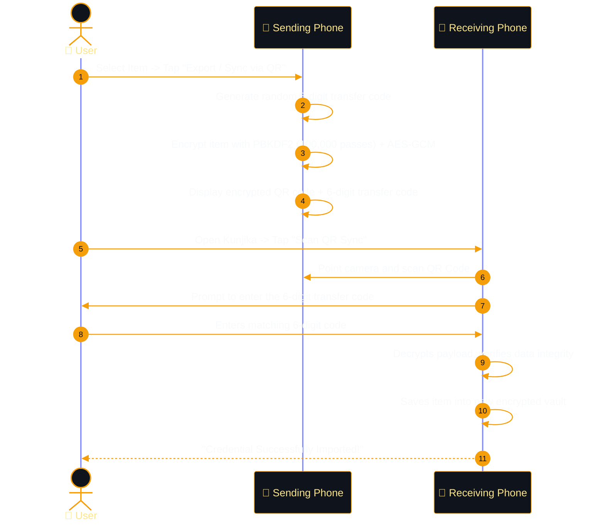
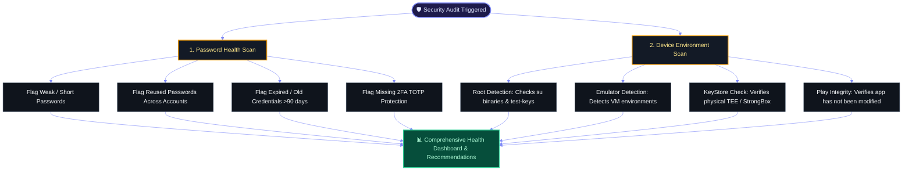

# 🏰 Kunjika

### *A 100% Offline, Military-Grade Password Vault & Generator for Android*

[](RELEASE_NOTES.md)
[-818CF8?style=flat-square&labelColor=1E1B4B&color=818CF8)](https://developer.android.com)
[](docs/features.md)
[](docs/security.md)
[](https://dwinsi.github.io/kunjika/web-companion/)
[](LICENSE)

---

## 💡 What is Kunjika?

Most password managers store your passwords on a company's cloud server. If that company is hacked, your digital life is exposed.

**Kunjika is fundamentally different.** It acts like an unbreakable digital safe that lives **strictly on your phone**.
- **No Cloud. No Accounts. No Internet Permission.** The app cannot communicate over the internet because the operating system physically blocks it from doing so.
- **Zero Knowledge & 100% Sovereign**: You are the only person who holds the key. Your data never leaves your device unless you physically transfer it yourself.

---

## 🌟 Key Features (In Plain English)

| Feature | What It Does | Why It Matters to You |
| :--- | :--- | :--- |
| **🚫 100% Offline (Air-Gapped)** | The app has **zero internet permission** in its code. | It is mathematically impossible for your passwords to leak online or be hacked remotely. |
| **🔐 Double-Lock Protection** | Every item is encrypted twice: first by your phone's physical security chip, then inside an encrypted database. | Even if someone steals your phone and extracts the database file, it is unreadable gibberish without your Master PIN. |
| **🎯 4-in-1 Smart Generator** | Generates strong passwords, multi-word passphrases (like `correct-horse-battery-staple`), numeric PINs, or 2FA secrets. | You never have to invent or reuse passwords again, and newly generated items are saved in an instant history list. |
| **⏰ Built-In 2FA Authenticator** | Generates rotating 6-digit two-factor codes with animated countdown timers. | No need for a separate app like Google Authenticator; your logins and 2FA codes live securely in one place. |
| **⚡ Web Drop (Send to PC)** | Beam passwords from your phone to your computer browser using Bluetooth & QR code. | No typing 30-character passwords on your PC keyboard, no cables, and no cloud relays. |
| **📱 Phone-to-Phone QR Transfer** | Move credentials between two phones by scanning a secure, encrypted QR code. | Transfer passwords to a new phone without using cloud backups, cables, or Wi-Fi. |
| **💎 Instant Biometric Unlock** | Unlock your vault instantly using your Fingerprint or Face. | Your Master PIN is securely unlocked by the phone's hardware chip without ever sitting unprotected in memory. |
| **🛡️ Tamper-Proof Audit Ledger** | A private digital ledger signs and timestamps every vault change (create, edit, delete). | Alerts you immediately if anyone or any malicious app attempts to alter your database behind your back. |
| **🔍 Phone Health & Vault Audit** | Scans your vault for weak or repeated passwords, and checks your phone for root or tampering. | Keeps your digital security hygiene at 100% and warns you if your operating system environment is unsafe. |
| **🎨 Obsidian Gold & Platinum Themes** | Built with luxury dark and light aesthetics, 3D specular reflections, and frosted glass components. | An interface that feels like a luxury Swiss watch rather than an ordinary utility tool. |

---

## 🎯 Handled Use Cases & Step-by-Step Flow Diagrams

Below are the primary use cases handled by Kunjika, illustrated with numbered step-by-step flows.

---

### Use Case 1: Generating & Saving a New Password or 2FA Code
*How Kunjika generates cryptographically secure passwords and stores them under double-lock encryption.*



1. **Choose Type**: Pick between standard passwords, readable multi-word passphrases, numeric PINs, or 2FA authenticator keys.
2. **Generate**: The app uses hardware-grade randomness and estimates how many centuries it would take a supercomputer to crack it.
3. **History Logging**: The item is logged in your local generation history so you don't lose it if you accidentally navigate away.
4. **Hardware Encryption**: When saved, the sensitive fields are locked with a key stored in your phone's physical security chip.
5. **Database Storage**: The encrypted record is committed to the encrypted database, and a digital signature is recorded in your audit log.

---

### Use Case 2: Sending a Password to Your Computer (Web Drop)
*How to log in to websites on your desktop or laptop without typing passwords or using the cloud.*



1. **Open Web Companion**: On your computer browser, open the [Web Companion](https://dwinsi.github.io/kunjika/web-companion/). It runs entirely in your browser's local memory.
2. **Scan the Screen**: On your phone, tap "Send to PC" and scan the QR code displayed on your monitor.
3. **Hardware Biometric Gate**: Approve the transfer on your phone with your fingerprint or face.
4. **Direct Bluetooth Stream**: The phone encrypts the password and sends it directly to your computer's Bluetooth antenna (range: 1–2 meters). Zero internet or cloud servers involved.
5. **Visual Code Check**: Both screens show matching 6-digit codes so you know no eavesdropper intercepted the signal.
6. **Auto-Wipe**: The password is auto-copied to your PC's clipboard. After 30 seconds, the browser wipes its memory and clears your clipboard automatically.

---

### Use Case 3: Transferring Passwords Between Two Phones (Air-Gapped QR Sync)
*How to migrate passwords to a new phone with complete privacy.*



1. **Select Item**: Choose any credential to transfer on your current phone.
2. **Dynamic Encryption**: The phone encrypts the credential using a temporary 6-digit code and creates an encrypted QR pattern on the screen.
3. **Scan with New Phone**: Open Kunjika on your new phone and point the camera at the first screen.
4. **Enter Code**: Type the 6-digit transfer code.
5. **Instant Import**: The new phone validates the integrity of the data and securely adds it to your new vault.

---

### Use Case 4: Vault Health & Phone Security Audit
*How Kunjika continuously protects you from compromised devices and weak passwords.*



---

## 🏗️ System Architecture & Component Breakdown

Kunjika follows **Security-First Clean Architecture**, separating user interface controls from core cryptographic operations.

```mermaid
%%{init: {
  'theme': 'base',
  'themeVariables': {
    'darkMode': true,
    'background': '#07090E',
    'mainBkg': '#0F141C',
    'primaryColor': '#131A26',
    'primaryTextColor': '#F8FAFC',
    'primaryBorderColor': '#F59E0B',
    'lineColor': '#F59E0B',
    'clusterBkg': '#0F141C',
    'clusterBorder': '#2B374A',
    'edgeLabelBackground': '#18202E'
  }
}}%%
graph TB
    subgraph UI ["🎨 1. Presentation Layer (Jetpack Compose)"]
        A[Auth & Lock Screen]
        B[Vault & Credential Details]
        C[4-in-1 Generator Engine]
        D[Security & Health Audit]
        E[Web Drop QR & BLE Dialog]
    end

    subgraph VM ["🧠 2. Controller Layer (ViewModels)"]
        F[AuthViewModel]
        G[VaultViewModel]
        H[GeneratorViewModel]
        I[SettingsViewModel]
    end

    subgraph Core ["🛡️ 3. Security & Cryptographic Core"]
        J[KeystoreManager<br/><b>Hardware TEE / StrongBox</b>]
        K[BiometricKeyManager<br/><b>BiometricPrompt CryptoObject</b>]
        L[BlockchainManager<br/><b>Local Tamper-Proof Ledger</b>]
        M[WebDropCrypto & BLE<br/><b>ECDH P-256 + GATT Server</b>]
        N[QrEncryptionManager<br/><b>PBKDF2 100k + AES-GCM</b>]
        O[Security & Integrity<br/><b>Root, Emulator & Play Integrity</b>]
    end

    subgraph Storage ["💾 4. Encrypted Storage Layer"]
        P[(SQLCipher Database<br/><b>256-bit AES SQLite</b>)]
        Q[(Encrypted DataStore<br/><b>Hardware-Backed Preferences</b>)]
    end

    UI --> VM
    VM --> Core
    Core --> Storage

    classDef goldNode fill:#131A26,stroke:#F59E0B,stroke-width:1.5px,color:#F8FAFC;
    classDef indigoNode fill:#1E1B4B,stroke:#818CF8,stroke-width:1.5px,color:#E0E7FF;
    classDef emeraldNode fill:#064E3B,stroke:#34D399,stroke-width:1.5px,color:#A7F3D0;
    classDef storageNode fill:#18202E,stroke:#FBBF24,stroke-width:2px,color:#FDE68A;

    class A,B,C,D,E goldNode;
    class F,G,H,I indigoNode;
    class J,K,L,M,N,O emeraldNode;
    class P,Q storageNode;

    style UI fill:#0F141C,stroke:#F59E0B,stroke-width:2px,color:#FDE68A
    style VM fill:#151238,stroke:#818CF8,stroke-width:2px,color:#C7D2FE
    style Core fill:#052e25,stroke:#34D399,stroke-width:2px,color:#A7F3D0
    style Storage fill:#18202E,stroke:#FBBF24,stroke-width:2px,color:#FDE68A
```



---

### Detailed Component Explanations

| Layer | Component | What It Does in Simple Terms | Technical Backing |
| :--- | :--- | :--- | :--- |
| **1. Presentation** | **Compose UI & Glossy Theme** | Renders all screens, high-contrast dark/light themes, 3D specular shine reflections, and interactive dialogs. | Jetpack Compose, Material 3, custom glossy canvas modifiers. |
| **2. Controller** | **ViewModels** | Coordinates user actions, handles input validation, and ensures data is passed cleanly to the cryptographic engine. | Android Architecture Components, StateFlow, Coroutines. |
| **3. Security Core** | **`KeystoreManager`** | Generates and manages the Master Encryption Key inside your phone's dedicated physical security chip. | Android KeyStore, Hardware-backed TEE / StrongBox Keymaster. |
| **3. Security Core** | **`BiometricKeyManager`** | Connects your fingerprint or face scan directly to cryptographic ciphers so your PIN is unlocked without storing plaintext. | `BiometricPrompt.CryptoObject`, AES-256-GCM. |
| **3. Security Core** | **`BlockchainManager`** | Records every vault modification into a cryptographically linked, hardware-signed digital ledger to detect database tampering. | Elliptic Curve (`secp256r1`) ECDSA digital signatures, SHA-256 hashing. |
| **3. Security Core** | **`WebDropCrypto` & `BLE`** | Enables direct, wireless password sharing to desktop browsers with zero cloud relays. | Web Bluetooth GATT server, Ephemeral ECDH P-256, Proof of Work. |
| **3. Security Core** | **`QrEncryptionManager`** | Encrypts phone-to-phone data transfer packages into scannable QR codes bound to one-time PINs. | PBKDF2 (100,000 iterations), AES-256-GCM. |
| **3. Security Core** | **`PlayIntegrity` & `Security`** | Continuously evaluates device environment to ensure the app is running safely. | Root detection heuristics, emulator checks, Google Play Integrity API. |
| **4. Storage** | **SQLCipher Database** | Stores your encrypted credentials, URLs, and notes on flash memory with military-grade 256-bit encryption. | SQLCipher SQLite engine, AES-256-CBC with HMAC-SHA512. |
| **4. Storage** | **Encrypted DataStore** | Stores application configuration, theme choices, and salt values securely. | AndroidX DataStore with hardware-encrypted preferences. |

---

## 🔒 Security & Privacy Comparison

| Security Feature | Standard Cloud Password Managers | Kunjika Sovereign Vault |
| :--- | :---: | :---: |
| **Network Exposure** | ⚠️ Connects to cloud servers over internet | 🛡️ **100% Offline (Zero Internet Permission)** |
| **Data Storage Location** | ⚠️ Third-party cloud servers | 🛡️ **Only inside your device's secure hardware** |
| **Phone-to-PC Sharing** | ⚠️ Syncs through remote cloud database | 🛡️ **Direct, air-gapped Bluetooth + Optical QR** |
| **Database Encryption** | Single-layer encryption | 🛡️ **Double-Lock (TEE Hardware Key + SQLCipher)** |
| **Tamper Detection** | Basic server logs | 🛡️ **Hardware-signed local blockchain ledger** |
| **Account Creation** | Requires Email, Password, Subscription | 🛡️ **Zero account, zero personal data collected** |
| **Screen Leak Protection** | Often optional or partial | 🛡️ **System-wide `FLAG_SECURE` blocks screenshots & recordings** |

---

## 🛠️ Technology Stack

- **Platform**: Android 15+ (Min API 35)
- **Language**: Kotlin 2.2.10 (100% Coroutines & Flow)
- **UI Framework**: Jetpack Compose (BOM 2025.02.00) with Material 3 & Custom Glossy Architecture
- **Database**: Room 2.8.4 + SQLCipher 4.6.1 (256-bit AES)
- **Biometrics**: AndroidX Biometric 1.2.0-alpha05 (`CryptoObject`)
- **Integrity**: Google Play Integrity API 1.6.0 + Hardware Attestation
- **Web Drop Companion**: Vanilla HTML5, CSS3, Web Bluetooth API, SubtleCrypto WebCrypto API

---

## 📚 Further Documentation

- [🏗️ Deep Architecture Overview](docs/architecture.md)
- [🛡️ Cryptography & Threat Model](docs/security.md)
- [✨ Complete Feature Guide](docs/features.md)
- [📋 Release Notes & Changelog](RELEASE_NOTES.md)
- [🌐 Web Companion Page](https://dwinsi.github.io/kunjika/web-companion/)
- [🔒 Privacy Policy](PRIVACY_POLICY.md)
- [📊 Play Store Data Safety](PLAY_STORE_DATA_SAFETY.md)

---

## 🚀 Getting Started

### For Developers
1. Clone the repository:
   ```bash
   git clone https://github.com/dwinsi/kunjika.git
   ```
2. Open the project in **Android Studio Ladybug (2024.2.1+)** or newer.
3. Sync project with Gradle files.
4. Run on a physical Android 15+ device or an API 35 emulator.

---

## ⚖️ License

Kunjika is open-source software licensed under the [MIT License](LICENSE).
