# 🏰 Kunjika

### *Military-Grade, Offline-First Sovereign Password Vault & Generator*

[](RELEASE_NOTES.md)
[-indigo.svg)](https://developer.android.com)
[](LICENSE)
[](docs/security.md)

Kunjika is a zero-network, ultra-secure Password Manager built for **Android 15+ (API 35)**. Engineered around a "Sovereign" security model, Kunjika ensures the user retains 100% ownership of their credentials with zero cloud dependencies and mathematical cryptographic proofs of integrity.

---

## 🛡️ Security Highlights

- **🚫 Zero Network**: Zero `INTERNET` permission in `AndroidManifest.xml`. Data physically cannot leave your device over the network.
- **🔐 Double Encryption**: AES-256-GCM (Android KeyStore TEE/StrongBox) + SQLCipher database encryption.
- **🧱 Blockchain Audit Log**: A hardware-signed (`secp256r1` ECDSA) ledger tracking every vault action to detect and prevent unauthorized file-level tampering.
- **📡 Air-Gapped Sync**: Encrypted QR-based transfer between devices using PBKDF2 (100,000 iterations) and AES-GCM.
- **⚡ Web Drop (BLE + Proof of Work)**: Air-gapped wireless credential transfer directly to desktop browsers with zero cloud relays, client-side PoW (`SHA-256`), ephemeral ECDH P-256 key agreement, and visual SAS verification.
- **💎 Hardware-Backed Biometric Binding**: Master PIN is encrypted using KeyStore TEE ciphers via `BiometricPrompt.CryptoObject`, enabling seamless biometric unlock without storing plaintext in memory.
- **🔍 Environment & Tamper Protection**: Real-time root detection, emulator environment heuristics, hardware KeyStore attestation, and Google Play Integrity API attestation.
- **🛡️ Screen Protection**: App-wide `FLAG_SECURE` prevents screenshots, screen recording, and task-switcher leakages.
- **🛡️ PIN Hardening**: Salted PBKDF2 hashing for Master PIN (100,000 iterations) with dynamic per-device salt.

---

## ✨ Features

- **🎨 Obsidian Gold & Platinum Dual Themes**: Crafted with a signature **Obsidian Gold & Midnight Indigo** luxury dark aesthetic (warm 24k gold `#F59E0B`, cosmic indigo `#818CF8`, pitch obsidian `#07090E`) and a sleek **Platinum Silver** light mode.
- **💎 Glassmorphic Glossy UI**: Custom `GlossyCard`, `GlossyButton`, `GlossyBadge`, and `GlossyTextField` components with specular top-shine gradients and frosted borders.
- **⚡ Air-Gapped Web Drop**: Wireless transfer to PC/Mac browsers via [Web Companion](https://dwinsi.github.io/kunjika/web-companion/) over Web Bluetooth (BLE), Proof of Work, and visual 6-digit TOTP verification.
- **🎯 4-in-1 Generator with History**: Passwords, Diceware Passphrases (10,000-word offline dictionary), Numeric PINs, and RFC 6238-compliant **TOTP Secrets** with generation history logging.
- **🗳️ Encrypted Vault**: Full management of credentials, URLs, and encrypted secure notes with custom categories.
- **⏰ Built-In TOTP Authenticator**: Hardware-protected 2FA code generation with circular countdown timers.
- **🔍 Security Health Audit**: Continuous audit of your vault highlighting weak, reused, or expired credentials alongside real-time Root, Emulator, and Play Integrity checks.
- **🪄 Native Autofill**: Seamless credential entry across Android applications and Chrome browsers.
- **📑 Recovery Kit**: Generate a secure PDF "Emergency Kit" with automated cache shredding.

---

## 🏗️ Architecture

Kunjika follows **Clean Architecture** principles with a focus on cryptographic integrity.

```mermaid
graph LR
    subgraph UI ["Compose UI Layer"]
        A[Vault Screen]
        B[Generator Screen]
        H[Security Audit]
        G[Glossy Design System]
    end
    subgraph Core ["Security Core"]
        C[KeystoreManager]
        D[BlockchainManager]
        E[QrEncryptionManager]
        W[WebDropCrypto & BLE]
        P[PlayIntegrity & Security]
    end
    subgraph Storage ["Encrypted Storage"]
        F[(SQLCipher DB)]
        S[(Encrypted DataStore)]
    end

    UI --> Core
    Core --> Storage
    
    style Core fill:#e8f5e9,stroke:#1b5e20,stroke-width:2px
    style Storage fill:#fff3e0,stroke:#e65100,stroke-width:2px
```



> [!NOTE]
> **Architecture Flow Explanation**: User Interface actions trigger the **Security Core** to process data before it reaches **Encrypted Storage**. Sensitive information is always handled by hardware-backed cryptographic modules (TEE/StrongBox) before being persisted.

---

## 📚 Documentation

Detailed documentation is available in the [`/docs`](docs/) directory:

- [🏗️ Architecture Overview](docs/architecture.md)
- [🛡️ Security Deep-Dive](docs/security.md)
- [✨ Feature Guide](docs/features.md)
- [📋 Release Notes](RELEASE_NOTES.md)
- [🌐 Web Companion](https://dwinsi.github.io/kunjika/web-companion/)
- [🔒 Privacy Policy](PRIVACY_POLICY.md)
- [📊 Play Store Data Safety](PLAY_STORE_DATA_SAFETY.md)

---

## 🛠️ Getting Started

### Prerequisites
- Android Studio Ladybug | 2024.2.1 (or newer)
- Android SDK 35 (Android 15+)
- JDK 17+

### Build & Run
1. Clone the repository:
   ```bash
   git clone https://github.com/dwinsi/kunjika.git
   ```
2. Open in Android Studio.
3. Sync Gradle dependencies.
4. Run on an Android 15+ device or emulator.

---

## ⚖️ License
Kunjika is licensed under the MIT License. See [LICENSE](LICENSE) for details.
