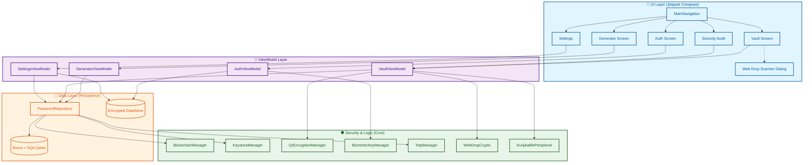

# 🏗️ Kunjika Architecture

Kunjika is built on a **Security-First Clean Architecture**, utilizing the latest Android Jetpack components and hardware-backed cryptographic primitives.

## 🏛️ High-Level Component Overview

The system is designed to ensure that sensitive data is **always encrypted at rest** and **never leaves the device**.

> [!NOTE]
> **Component Overview Explanation**: This diagram illustrates the layered architecture of Kunjika. The **UI Layer** (blue) interacts with **ViewModels** (purple), which communicate with the **Repository Layer** (orange). The **Security Core** (green) provides cryptographic services like hardware-backed encryption (KeyStore), blockchain signatures, and air-gapped Web Drop protocols. Data is persisted in **Encrypted Storage** using SQLCipher and DataStore.

## 🔄 Core Data Flows

### 1. Hardware-Backed Encryption Flow
Kunjika uses a **Double Encryption** strategy. Passwords are first encrypted with a hardware-backed key before being stored in a database that is *also* encrypted with a random key.

### 2. Tamper-Proof Audit (Blockchain)
Every write operation (Create/Update/Delete/Export) generates a new block in a local blockchain.
- **Content Hash**: SHA-256 of the entity data.
- **Signature**: Signed with a hardware-backed **ECDSA** key.
- **Merkle Link**: Each block contains the hash of the previous block, preventing unauthorized history manipulation.

### 3. Air-Gapped Phone-to-Phone Sync (Encrypted QR)
Data is transferred between mobile devices using short-lived encrypted QR codes.
- **Key Derivation**: PBKDF2 derived from a 6-digit one-time code.
- **Encryption**: AES-GCM for authenticated encryption.

### 4. Air-Gapped Web Drop Flow (Web Bluetooth + WebCrypto)
Enables secure transmission of passwords to desktop browsers without internet connectivity.
- **Proof of Work Check**: Phone verifies browser's SHA-256 PoW challenge (`< 0x0800...`).
- **ECDH P-256 Key Exchange**: Android app parses browser's uncompressed public key and computes a 256-bit shared secret via HKDF (`"kunjika-web-drop-v1"`).
- **SAS Verification**: Both devices calculate and display a synchronized 6-digit TOTP verification code for user visual confirmation.
- **Biometric Authorization**: User completes biometric authentication (`BIOMETRIC_STRONG`).
- **BLE GATT Transmission**: Phone starts a BLE GATT peripheral server and transmits AES-256-GCM encrypted chunks directly to the browser.
- **Blockchain Audit**: App logs an `EXPORT_BLE` block into the local ledger.

## 🛠️ Technology Stack
- **Language**: 100% Kotlin (Android), Modern Vanilla JavaScript (Web Companion)
- **UI**: Jetpack Compose (Material 3)
- **Database**: Room + SQLCipher
- **Connectivity**: Web Bluetooth API (GATT Peripheral / Client), CameraX (QR Scanner)
- **Dependency Injection**: Manual (Constructor Injection)
- **Asynchrony**: Kotlin Coroutines & Flow
- **Security**: Android KeyStore API, Biometric Library, WebCrypto API, Tink-inspired Cryptography
