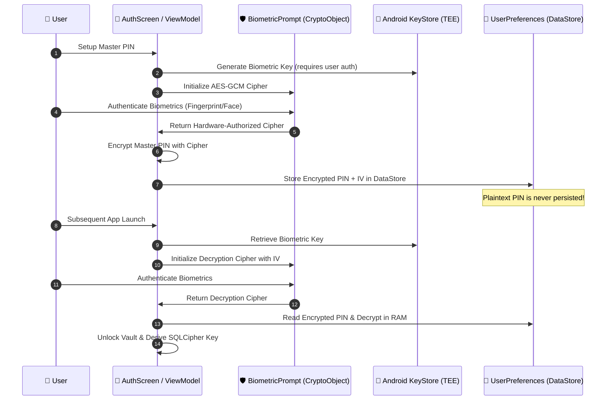

# 🏗️ Kunjika Architecture

Kunjika is built on a **Security-First Clean Architecture**, combining the latest Android Jetpack components with hardware-backed cryptographic primitives and zero-network privacy.

---

## 🏛️ High-Level Component Architecture

The architecture ensures that sensitive credentials are **always encrypted at rest and in transit** and **physically prohibited from touching the network**.

```mermaid
graph TB
    %% Definitions
    subgraph UI ["🎨 UI Layer (Jetpack Compose & Material 3)"]
        Nav[MainNavigation]
        Auth[Auth Screen]
        Gen[Generator Screen & History]
        Vault[Vault Screen]
        Audit[Security Audit & Integrity]
        Settings[Settings Screen]
        WebDrop[Web Drop Scanner Dialog]
        Glossy[Glossy Design System]
    end

    subgraph VM ["🧠 ViewModel Layer"]
        AVM[AuthViewModel]
        GVM[GeneratorViewModel]
        VVM[VaultViewModel]
        SVM[SettingsViewModel]
    end

    subgraph Domain ["🛡️ Security & Core Logic"]
        direction LR
        BC[BlockchainManager]
        KE[KeystoreManager]
        QR[QrEncryptionManager]
        BK[BiometricKeyManager]
        TOTP[TotpManager]
        WDC[WebDropCrypto]
        BLE[KunjikaBlePeripheral]
        SEC[SecurityManager]
        PIM[PlayIntegrityManager]
    end

    subgraph Data ["💾 Data Layer (Persistence)"]
        Repo[PasswordRepository]
        Room[(Room + SQLCipher)]
        DS[(UserPreferences / DataStore)]
    end

    %% Connections
    Nav --> Auth & Gen & Vault & Audit & Settings
    Auth & Gen & Vault & Audit & Settings -.-> Glossy
    Auth --> AVM
    Gen --> GVM
    Vault --> VVM
    Audit --> VVM
    Settings --> SVM
    Vault -.-> WebDrop

    GVM & VVM & SVM --> Repo
    AVM & SVM --> DS
    
    Repo --> BC & KE & TOTP
    Repo --> Room
    
    VVM --> QR & WDC & BLE
    AVM --> BK & SEC & PIM
    Audit --> SEC & PIM

    %% Styling
    classDef ui fill:#e1f5fe,stroke:#01579b,stroke-width:2px,color:#01579b;
    classDef vm fill:#f3e5f5,stroke:#4a148c,stroke-width:2px,color:#4a148c;
    classDef core fill:#e8f5e9,stroke:#1b5e20,stroke-width:2px,color:#1b5e20;
    classDef data fill:#fff3e0,stroke:#e65100,stroke-width:2px,color:#e65100;

    class UI,Nav,Auth,Gen,Vault,Audit,Settings,WebDrop,Glossy ui;
    class VM,AVM,GVM,VVM,SVM vm;
    class Domain,BC,KE,QR,BK,TOTP,WDC,BLE,SEC,PIM core;
    class Data,Repo,Room,DS data;
```

> [!NOTE]
> **Layered Decoupling**: The **UI Layer** interacts strictly through **ViewModels**, delegating cryptographic operations to isolated **Security Core** singletons and managers. Storage persistence is doubly protected via **Room + SQLCipher** and hardware-encrypted **DataStore** preferences.

---

## 🔄 Core Data Flows

### 1. Double-Lock Encryption Flow
Kunjika implements a two-stage encryption pipeline:
1. **Field-Level Encryption**: Every sensitive credential field is encrypted with an individual AES-256-GCM cipher keyed by the Android KeyStore TEE master key.
2. **Database-Level Encryption**: The encrypted payload is persisted within a 256-bit SQLCipher SQLite database, unlocked by a unique key derived via PBKDF2 (100,000 iterations) from the Master PIN.

### 2. Hardware-Bound Biometric PIN Storage Flow
To achieve instant biometric unlock without compromising PIN entropy or persisting plaintext:

### 3. Local Blockchain Ledger Flow
Every mutation (Create, Update, Delete, Export) writes a signed block to the internal blockchain ledger:
- **Payload Digest**: SHA-256 hash of the modified entity.
- **Hardware Signature**: Signed with an elliptic curve (`secp256r1`) private key residing inside the device's TEE/StrongBox.
- **Merkle Chain Link**: Each block contains `previousBlockHash`, creating an immutable cryptographic chain that detects direct database file tampering.

### 4. Environmental Integrity & Tamper Protection
Before granting access to sensitive cryptographic operations:
- **Root Verification**: Checks for `su` binaries across system locations, inspects `Build.TAGS` for `test-keys`, and executes a runtime `which su` probe.
- **Emulator Verification**: Inspects build properties, brand/device markers, hardware signatures (`goldfish`, `ranchu`), and product names (`google_sdk`, `vbox86p`).
- **Hardware KeyStore Validation**: Confirms via `KeyInfo.isInsideSecureHardware` whether the active master key is physically hosted in a TEE or StrongBox.
- **Play Integrity API**: Verifies that the app binary is genuine and has not been repackaged or tampered with.

### 5. Air-Gapped Web Drop Flow (BLE GATT with Reassembly)
Enables secure transmission of passwords to desktop browsers without network access:
- **Proof of Work Verification**: Phone validates browser's dynamic SHA-256 PoW challenge (`< 0x0800...`).
- **ECDH P-256 Key Exchange**: Phone scans the browser's 65-byte uncompressed public key and computes a 256-bit shared secret using HKDF-SHA256 (`"kunjika-web-drop-v1"`).
- **Visual SAS Code**: Both devices independently compute and display a 6-digit TOTP confirmation code for visual comparison.
- **Biometric Gate**: User authorizes the transfer via `BiometricPrompt` (`BIOMETRIC_STRONG`).
- **BLE GATT Chunking & Retries**: The phone acts as a peripheral GATT server advertising Service `e9a30001-c852-4e08-9bfa-87bb0f592658`, streaming chunked AES-256-GCM ciphertext with sequence numbering and notification retries to guarantee flawless transmission.
- **Audit Log**: An `EXPORT_BLE` block is appended to the local blockchain ledger.

---

## 🛠️ Technology Stack & Dependencies

| Component | Technology | Version | Purpose |
| :--- | :--- | :--- | :--- |
| **Language** | Kotlin | `2.2.10` | 100% modern coroutine-first Android codebase |
| **Build System** | Android Gradle Plugin (AGP) | `9.4.0` | Modern build toolchain |
| **Compiler Plugin** | KSP (Kotlin Symbol Processing) | `2.3.6` | Room annotation processing |
| **UI Toolkit** | Jetpack Compose (BOM) | `2025.02.00` | Declarative UI with Material 3 |
| **Navigation** | Navigation Compose | `2.8.7` | Type-safe in-app navigation |
| **Database** | Room + SQLCipher | `2.8.4` / `4.6.1` | Local SQLite database with 256-bit AES encryption |
| **Biometrics** | AndroidX Biometric | `1.2.0-alpha05` | Hardware biometric authentication & `CryptoObject` |
| **Security Integrity** | Google Play Integrity | `1.6.0` | Application attestation and tamper protection |
| **Preferences** | Jetpack DataStore | `1.1.2` | Encrypted key-value storage |
| **Camera & Barcode** | CameraX + ML Kit Barcode | `1.4.1` / `17.3.0` | QR code scanning for air-gapped sync |
| **Bluetooth** | Android Bluetooth Low Energy | API 35 Native | BLE GATT Peripheral server for Web Drop |
| **Desktop Companion**| HTML5 / Vanilla JS / WebCrypto | Native | Client-side RAM-only Web Drop receiver |
