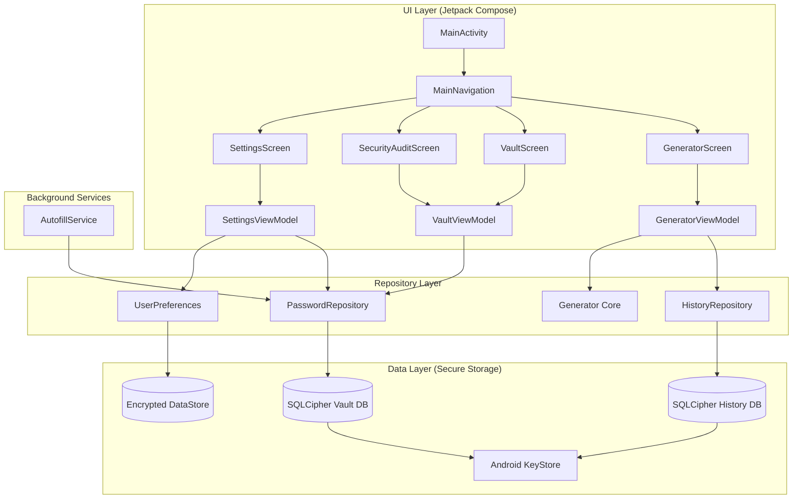

# Architecture Documentation

KeyFortress follows a modern Android architecture based on **Clean Architecture** and **MVVM (Model-View-ViewModel)** patterns, optimized for offline-first security.

## Core Components

The app is divided into three main layers:

1.  **UI Layer**: Jetpack Compose screens and ViewModels.
2.  **Domain/Repository Layer**: Repositories that orchestrate data flow between local storage and business logic.
3.  **Data Layer**: Room database (SQLCipher), DataStore (Preferences), and core security managers (Android KeyStore).

## System Architecture Diagram

## Data Flow

1.  **Generation**: `GeneratorViewModel` calls the `PasswordGenerator` core. Once generated, the password is encrypted via `KeystoreManager` and saved to `HistoryRepository`.
2.  **Vault Management**: `VaultViewModel` interacts with `PasswordRepository`. Passwords are encrypted *before* hitting the database using a hardware-backed key.
3.  **Security Audit**: `VaultViewModel` performs a background scan of all decrypted credentials to calculate entropy and detect reuse without ever exposing raw data to the system.
4.  **Autofill**: The `KeyFortressAutofillService` runs in a separate system process, querying the `PasswordRepository` securely to suggest credentials in other apps.
