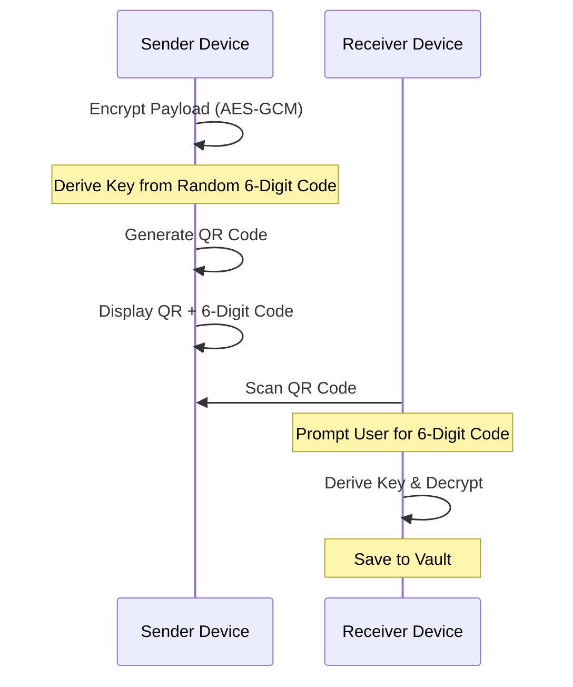

# ✨ Kunjika Features

Kunjika combines military-grade security with a modern, intuitive user interface.

## 🚀 Key Modules

### 1. Smart Password Engine
- **Entropy Analysis**: Real-time bit-strength calculation and "Time-to-Crack" estimation.
- **Memorable Passphrases**: Diceware-style generation using a local 10,000-word dictionary.
- **Custom Character Sets**: Full control over symbols, ambiguity, and length.

### 2. The Secure Vault
- **Double Encryption**: Every entry is encrypted twice before hitting the disk.
- **TOTP Authenticator**: Built-in 2FA support with hardware-protected secrets.
- **Categorization**: Organize by Personal, Work, Finance, Social, etc.

### 3. Air-Gapped Sync (Zero-Network)
Transfer credentials between devices without Bluetooth, Wi-Fi, or Cloud.

> [!NOTE]
> **QR Sync Sequence Explanation**: This sequence diagram shows the air-gapped synchronization process. The **Sender** encrypts the payload using a key derived from a random 6-digit code. The **Receiver** scans the QR code and prompts the user for the same 6-digit code to derive the decryption key. This ensures that the sensitive data is never exposed in plaintext, even within the QR code itself.

### 4. Security Audit & Health
- **Vulnerability Scanner**: Detects weak, reused, and old passwords.
- **Blockchain Verification**: One-tap verification of the entire vault's cryptographic integrity.
- **Audit Logs**: Review every change made to your vault in the signed ledger.

### 5. System Integration
- **Autofill Service**: Native Android Autofill support for Apps and Chrome.
- **Biometric Unlock**: Fingerprint, Face, and Iris support via Android Biometric Library.
- **FLAG_SECURE**: Protection against screenshots and screen recording app-wide.

## 📋 Feature Roadmap
- [x] TOTP Support
- [x] Local Blockchain Audit
- [x] Encrypted QR Sync
- [x] PBKDF2 PIN Hashing
- [ ] Multi-Vault Support
- [ ] Secure Notes Attachment
- [ ] Browser Extension (Companion)
