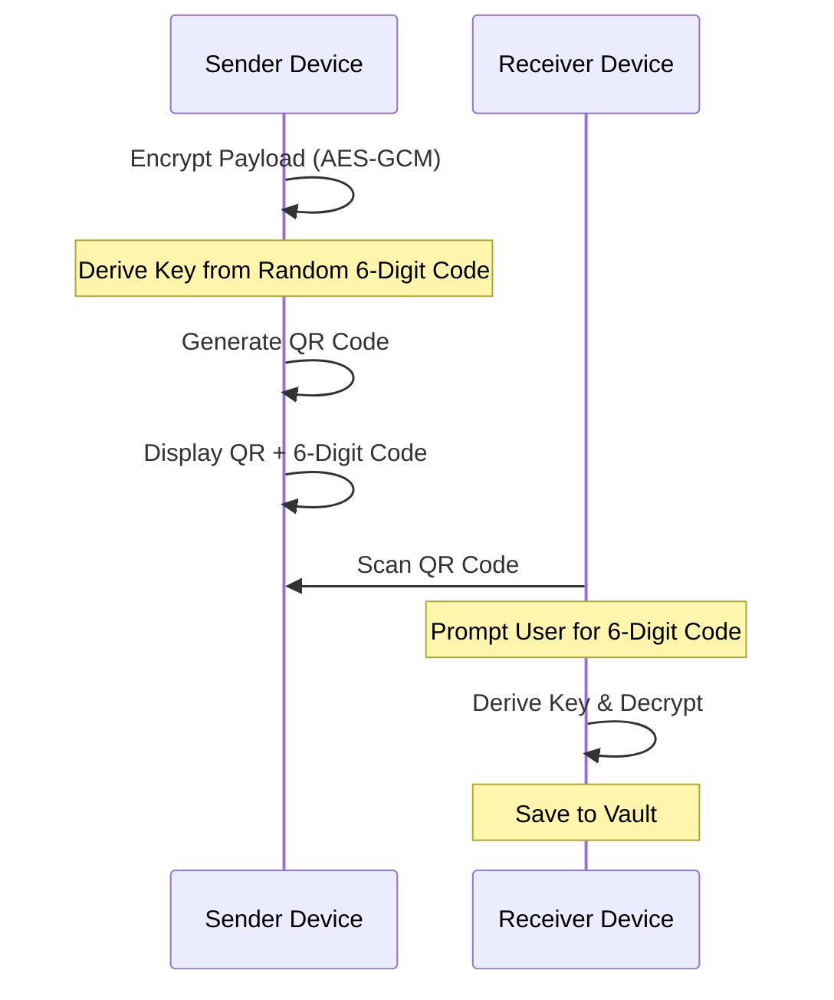
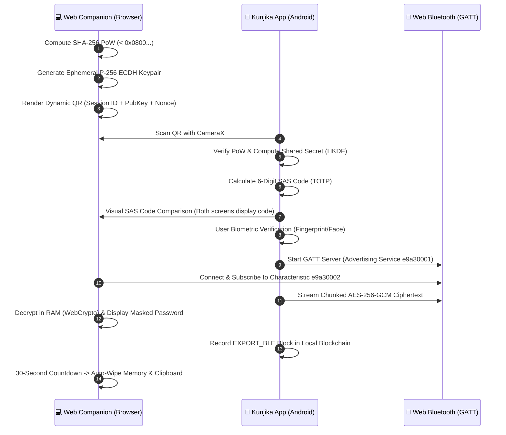

# ✨ Kunjika Features

Kunjika combines military-grade security with a modern, intuitive user interface.

## 🚀 Key Modules

### 1. Smart Password Engine
- **Entropy Analysis**: Real-time bit-strength calculation and "Time-to-Crack" estimation.
- **Memorable Passphrases**: Diceware-style generation using a local 10,000-word dictionary.
- **Custom Character Sets**: Full control over symbols, ambiguity, and length.

### 2. The Secure Vault
- **Double Encryption**: Every entry is encrypted twice before hitting the disk.
- **TOTP Authenticator**: Built-in 2FA support with hardware-protected secrets.
- **Categorization**: Organize by Personal, Work, Finance, Social, etc.

### 3. Air-Gapped QR Sync (Phone-to-Phone)
Transfer credentials between mobile devices without Bluetooth, Wi-Fi, or Cloud.

> [!NOTE]
> **QR Sync Sequence Explanation**: This sequence diagram shows the air-gapped phone-to-phone synchronization process. The **Sender** encrypts the payload using a key derived from a random 6-digit code. The **Receiver** scans the QR code and prompts the user for the same 6-digit code to derive the decryption key. This ensures that the sensitive data is never exposed in plaintext, even within the QR code itself.

### 4. Air-Gapped Web Drop (Phone-to-PC Wireless Sync)
Eliminates manual typing of 32+ character high-entropy passwords on desktop and laptop computers without cloud sync or accounts.

- **Zero Internet Requirement**: Works completely offline. The [Web Companion](https://dwinsi.github.io/kunjika/web-companion/) runs locally in browser RAM with zero server communication.
- **Client-Side Proof of Work (PoW)**: Browser generates an ephemeral session secured by a SHA-256 PoW challenge (`< 0x0800...`), auto-refreshing every 60 seconds to prevent replay attacks.
- **Ephemeral ECDH P-256 Key Exchange**: Browser generates an in-memory EC P-256 keypair; the phone scans the uncompressed public key and derives a shared secret via HKDF-SHA256 (`"kunjika-web-drop-v1"`).
- **Visual Short Authentication String (SAS)**: Both devices derive and display a matching 6-digit TOTP verification code. The user visually confirms parity on both screens before authorizing the transfer.
- **Hardware-Backed Biometric Gate**: Android `BiometricPrompt` (`BIOMETRIC_STRONG`) is required to authorize the BLE transfer.
- **Direct Web Bluetooth (BLE GATT)**: Phone acts as a BLE GATT peripheral server (`e9a30001-c852-4e08-9bfa-87bb0f592658`) and streams chunked AES-256-GCM ciphertext directly to the browser.
- **RAM-Only Auto-Wipe**: Browser decrypts into memory, copies to clipboard on user tap, and triggers a 30-second visual countdown before wiping both memory and clipboard.
- **Tamper-Evident Audit Trail**: Every Web Drop operation automatically appends an `EXPORT_BLE` block to the local hardware-signed blockchain ledger.

### 5. Security Audit & Health
- **Vulnerability Scanner**: Detects weak, reused, and old passwords.
- **Blockchain Verification**: One-tap verification of the entire vault's cryptographic integrity.
- **Audit Logs**: Review every change made to your vault in the signed ledger.

### 6. System Integration
- **Autofill Service**: Native Android Autofill support for Apps and Chrome.
- **Biometric Unlock**: Fingerprint, Face, and Iris support via Android Biometric Library.
- **FLAG_SECURE**: Protection against screenshots and screen recording app-wide.

## 📋 Feature Roadmap
- [x] TOTP Support
- [x] Local Blockchain Audit
- [x] Encrypted QR Sync (Phone-to-Phone)
- [x] Air-Gapped Web Drop (Web Bluetooth + Proof of Work Companion)
- [x] PBKDF2 PIN Hashing
- [ ] Multi-Vault Support
- [ ] Secure Notes Attachment
- [ ] Browser Extension (Companion)
