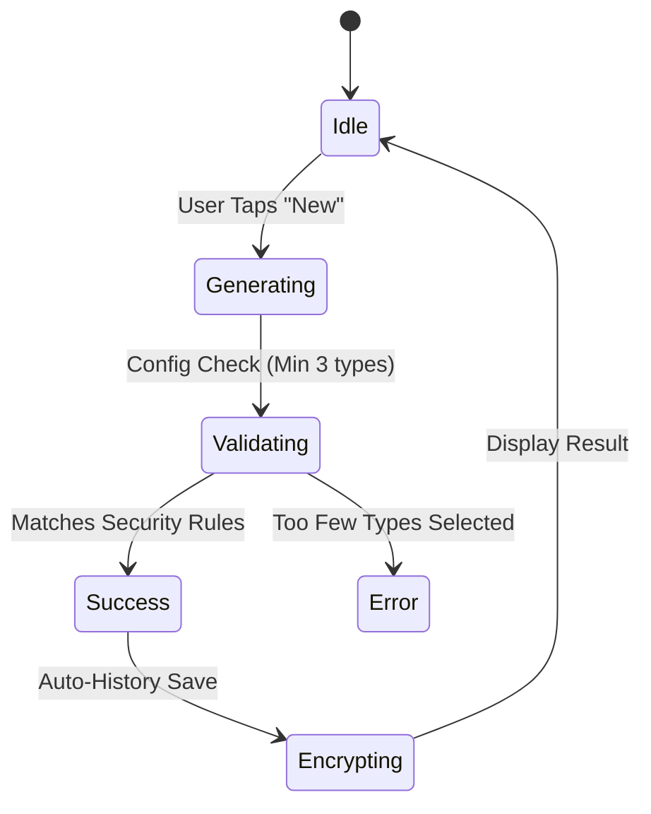

# Feature Documentation

This document describes the primary features of KeyFortress and how they improve user security and experience.

## 1. Smart Generator
Supports three distinct modes with high-entropy defaults:
*   **Passwords**: Alphanumeric with specialized symbol sets (`!@#$%^&*()_`). Enforces at least 3 character types for production safety.
*   **Passphrases**: Word-based keys using offline dictionaries (higher memorability, high entropy).
*   **PINs**: Numeric-only keys for device or secondary app codes.

### Generator State Flow

## 2. Encrypted Vault & Audit
*   **Search**: Real-time searching through Title, Username, or Notes.
*   **Security Health**: Automatically calculates entropy (bits) for every entry.
*   **Rotation Reminders**: Users can set 30, 90, or 180-day rotation periods. The vault flags "Expired" items in the Security Audit tab.

## 3. System Autofill
The app integrates natively with Android's `AutofillService`.
*   **Matches by Domain**: Securely matches `websiteUrl` or `title` against the calling app's package name or web domain.
*   **Modern API Support**: Uses `Field.Builder` for Android 13+ (API 33) and falls back gracefully for older versions.

## 4. Encrypted History
*   Stores the last 50 generations.
*   Data is encrypted with the hardware key.
*   Accessible via a dedicated "History" tab in the Generator screen.
