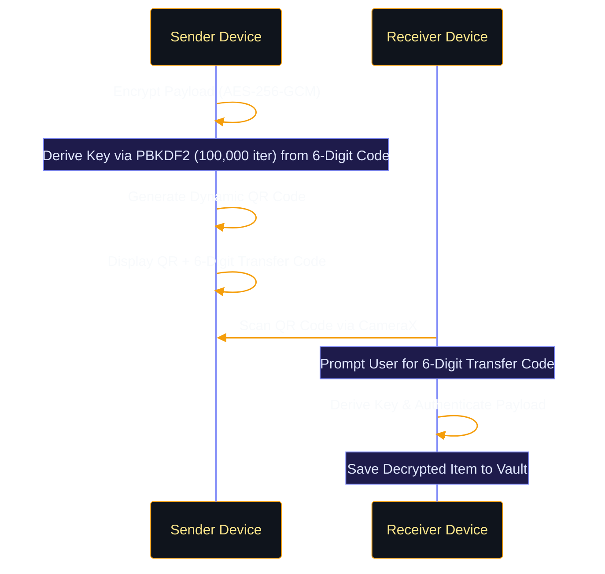
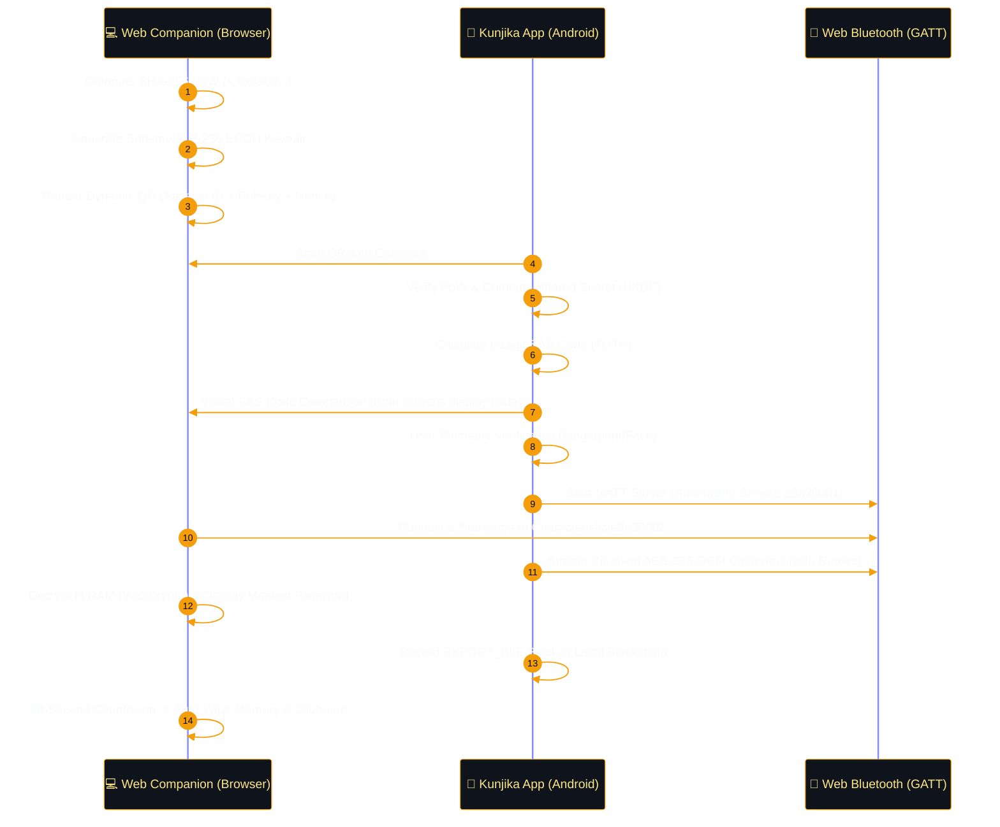

# ✨ Kunjika Features

Kunjika combines military-grade offline security with a modern, ultra-premium user interface engineered for Android 15+ (API 35) styled in the signature **Obsidian Gold & Midnight Indigo** aesthetic.

---

## 🚀 Key Modules

### 1. Smart Generator Engine (4-in-1)
Kunjika features an intelligent, multi-mode cryptographic generator designed for diverse authentication scenarios:

- **Password Mode**:
  - Real-time bit-entropy calculation and "Time-to-Crack" estimation.
  - Granular character set controls (uppercase, lowercase, digits, symbols).
  - Ambiguity filter (excludes confusing characters like `l`, `1`, `I`, `O`, `0`).
- **Passphrase Mode**:
  - Cryptographically secure Diceware-style generation using an offline 10,000-word dictionary.
  - Configurable word counts (3 to 8 words) and custom separators (`-`, `_`, `.`, ` `).
- **Numeric PIN Mode**:
  - High-entropy random numeric passcode generation of custom length (4 to 12 digits).
- **TOTP Secret Generation Mode**:
  - Generates RFC 6238-compliant 160-bit Base32 secret keys for setting up two-factor authentication.
  - One-tap copy or direct bookmarking into the vault.
- **Manual Generation Workflow & History**:
  - Passwords and tokens are generated strictly upon explicit user request ("Generate" / "Regenerate"), avoiding clutter and accidental overwrites.
  - **Persistent Generation History**: Access timestamped records of recently generated credentials with instant copy and reuse actions.

---

### 2. The Secure Vault
- **Double-Lock Encryption**: Every entry is encrypted individually with an AES-256-GCM key from the hardware TEE before entering the SQLCipher database.
- **Built-In TOTP Authenticator**: Integrated two-factor authenticator displaying animated circular countdown timers without needing external apps like Google Authenticator.
- **Categorization & Filtering**: Organize credentials by **Personal**, **Work**, **Finance**, and **Social** with instant search, favorite pinning, and credential strength indicators.
- **Encrypted Secure Notes**: Attach encrypted metadata, recovery keys, and notes to any vault entry.

---

### 3. Air-Gapped QR Sync (Phone-to-Phone)
Securely transfer credentials between two mobile devices without Bluetooth, Wi-Fi, cell service, or cloud intermediaries.

> [!NOTE]
> **Air-Gapped QR Sequence**: Sensitive credentials are never exposed in plaintext within the QR code. The payload is encrypted with AES-256-GCM using a PBKDF2-derived key (100,000 iterations) bound to a random 6-digit code.

---

### 4. Air-Gapped Web Drop (Phone-to-PC Wireless Sync)
Eliminates manual typing of 32+ character high-entropy passwords on desktop and laptop computers without cloud accounts or relays.

- **Zero Internet Requirement**: Completely air-gapped. The [Web Companion](https://dwinsi.github.io/kunjika/web-companion/) executes locally inside browser RAM with zero server communication.
- **Client-Side Proof of Work (PoW)**: Browser solves an ephemeral SHA-256 PoW challenge (`< 0x0800...`), auto-refreshing every 60 seconds to prevent replay attacks.
- **Ephemeral ECDH P-256 Key Exchange**: Browser generates an in-memory EC P-256 keypair; the phone scans the 65-byte uncompressed public key and computes a shared secret via HKDF-SHA256 (`"kunjika-web-drop-v1"`).
- **Visual Short Authentication String (SAS)**: Both devices derive and display a matching 6-digit TOTP verification code. The user visually confirms parity before authorizing transmission.
- **Hardware-Backed Biometric Gate**: Android `BiometricPrompt` (`BIOMETRIC_STRONG`) is required to authorize the BLE transfer.
- **Direct Web Bluetooth (BLE GATT) with Retry Logic**: Phone operates as a GATT peripheral server (`e9a30001-c852-4e08-9bfa-87bb0f592658`), streaming chunked AES-256-GCM ciphertext with sequence numbering and notification retries.
- **RAM-Only Auto-Wipe**: Browser decrypts into volatile memory, copies to clipboard upon user interaction, and automatically wipes RAM and OS clipboard after a 30-second countdown.
- **Tamper-Evident Audit Trail**: Every Web Drop operation automatically appends an `EXPORT_BLE` block to the local hardware-signed blockchain ledger.

---

### 5. Security Audit & Environmental Health
The Security Audit suite provides proactive threat detection and integrity analysis:

- **Vulnerability Scanner**: Identifies weak passwords, reused credentials, old credentials (>90 days), and missing 2FA configurations.
- **Real-Time Root Detection**: Deep checks for `su` binaries across system paths (`/sbin/su`, `/system/xbin/su`, `/data/local/su`), `test-keys` OS builds, and execution probe verification.
- **Emulator Environment Detection**: Heuristic detection of emulated virtual machines (goldfish/ranchu hardware, generic build props, QEMU signatures).
- **Hardware KeyStore Attestation**: Verifies whether cryptographic master keys are protected inside physical hardware (TEE/StrongBox) via `KeyInfo.isInsideSecureHardware`.
- **Google Play Integrity API**: Interactive on-device attestation tester to verify application package integrity, signature validity, and licensing state.
- **Blockchain Integrity Verification**: One-tap validation of the entire cryptographic chain to detect direct database tampering or byte-level manipulation.

---

### 6. Visual Identity & Dual-Theme Engine
- **Obsidian Gold & Midnight Indigo (Default Luxury Dark)**:
  - Deep Obsidian surface (`#07090E`), elevated card layers (`#0F141C`, `#18202E`).
  - Warm 24k Gold accents (`#F59E0B`, `#FBBF24`) and Cryptographic Indigo (`#818CF8`, `#6366F1`).
- **Platinum Silver (Light Mode)**:
  - Clean metallic surfaces (`#F8FAFC`, `#CBD5E1`) with high-contrast typography.
- **Glossy UI Components**:
  - `GlossyCard`, `GlossyButton`, `GlossyBadge`, and `GlossyTextField` with specular top-shine gradients, frosted glass borders, and smooth spring animations.
- **Web Companion Matching Themes**:
  - Seamless theme toggle on desktop browser matching the mobile visual identity.

---

### 7. System Integration & Access Control
- **Biometric-Backed PIN Storage**: Hardware-bound encryption for the Master PIN using KeyStore TEE ciphers via `BiometricPrompt.CryptoObject`, providing zero-friction instant biometric unlock.
- **Native Android Autofill**: Integrated Autofill framework support for autofilling apps and websites.
- **Screen Capture Protection**: App-wide `FLAG_SECURE` blocks screenshots, screen mirroring, and system app switcher previews.
- **Emergency Recovery Kit**: Generate a printable, encrypted PDF backup with automatic cache shredding.

---

## 📋 Feature Roadmap
- [x] TOTP Authenticator & Generator
- [x] Persistent Generation History
- [x] Local Blockchain Audit Ledger
- [x] Encrypted QR Sync (Phone-to-Phone)
- [x] Air-Gapped Web Drop (Web Bluetooth + Proof of Work Companion)
- [x] PBKDF2 PIN Hashing (100,000 iterations)
- [x] Biometric-Backed PIN Storage (TEE unwrap)
- [x] Google Play Integrity API Integration
- [x] Obsidian Gold & Platinum Dual-Theme System
- [x] Real-Time Root & Emulator Detection
- [ ] Multi-Vault Separation
- [ ] Secure Notes File Attachment
- [ ] Dedicated Desktop Browser Extension
