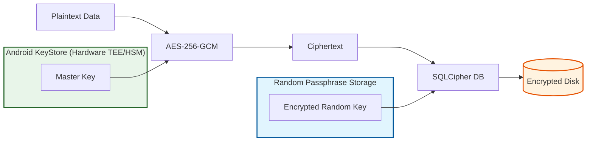
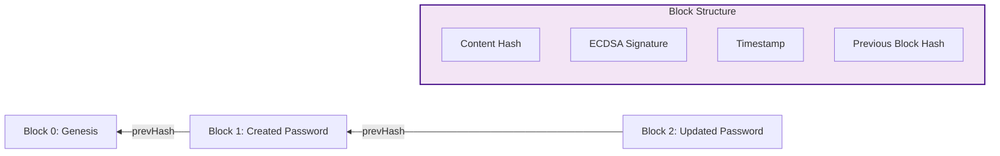

# 🛡️ Security Deep-Dive

Kunjika is engineered to exceed military-grade standards for local data protection. It operates on a **Zero-Network, Zero-Trust** model.

## 🗝️ Encryption Strategy: "Double-Lock" Architecture

Kunjika doesn't just encrypt the database; it encrypts the data *inside* the encrypted database.

> [!NOTE]
> **Double-Lock Architecture Explanation**: This diagram visualizes our "Double-Lock" security model. Plaintext data is first encrypted using **AES-256-GCM** with a master key from the **Android KeyStore** (TEE/HSM). The resulting ciphertext is then stored in a **SQLCipher Database**, which is itself locked with a unique random passphrase, providing two independent layers of hardware-backed protection.

### 1. The Hardware Layer (KeyStore)
Sensitive keys are generated inside the device's **Trusted Execution Environment (TEE)** or **Secure Element (SE)**. The private/secret keys never leave this hardware.
- **Master Key**: AES-256 for vault data.
- **Identity Key**: EC (secp256r1) for Blockchain signatures.
- **Biometric Key**: Requires `setUserAuthenticationRequired(true)`.

### 2. The Database Layer (SQLCipher)
- **Random Passphrase**: On first run, a 256-bit random key is generated.
- **Key Storage**: This key is encrypted by the Master Key and stored in DataStore.
- **SQLCipher**: The database is unlocked using this unique, non-deterministic key.

## 🧱 Local Blockchain Audit Log

To prevent "Offline Modification Attacks" (where an attacker with root access modifies the SQLite file directly), Kunjika maintains a cryptographically signed ledger.

> [!NOTE]
> **Blockchain Ledger Explanation**: The blockchain audit log creates a cryptographically linked chain of vault actions. Each block contains a **Content Hash** of the action, an **ECDSA Signature** from the hardware-backed Identity Key, and a **Merkle Link** (hash) to the previous block. This ensures that any manual tampering with the database file can be immediately detected.

## 🔐 Authentication & Access
- **Master PIN**: Protected via **PBKDF2WithHmacSHA256** with **100,000 iterations** and a unique 16-byte salt.
- **Biometric Binding**: Authentication is cryptographically bound to a KeyStore key. A UI-bypass (like Frida) cannot unlock the encryption without a hardware-verified biometric success.
- **Auto-Lock**: Foreground/Background lifecycle observers trigger an immediate vault lock.

## 📂 Secure Export & Sync
- **QR Sync**: AES-GCM encryption with keys derived via PBKDF2 from a 6-digit Transfer Code.
- **Backup**: AES-256-GCM backups with user-provided passphrases.
- **Cache Purge**: Recovery Kits (PDFs) are automatically deleted from the cache after use to prevent data residue.
