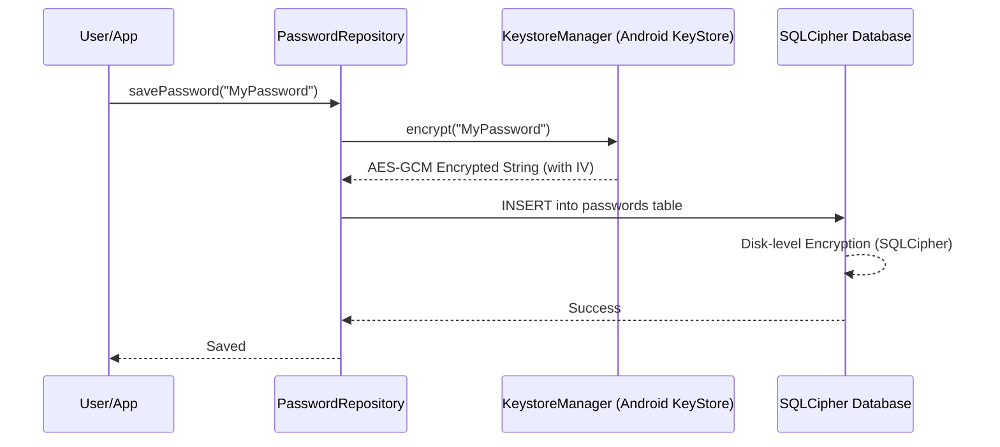

# Security Documentation

KeyFortress is designed with a "Privacy-First" philosophy. It operates entirely offline and utilizes hardware-backed encryption.

## Encryption Flow

We use a multi-layered encryption strategy:

1.  **Application Layer**: Before any sensitive data is saved, it is encrypted using an AES-256-GCM key stored in the **Android KeyStore**.
2.  **Storage Layer**: The database itself is encrypted using **SQLCipher**, with a key derived from the same hardware-backed secret.

### Encryption Mermaid Diagram

## Security Features

### 1. Root & Integrity Detection
The `SecurityManager` monitors the device for compromise. If root binaries (`su`) or test-keys are found, the app displays a critical warning. This protects the user from other apps that might bypass Android's standard sandbox.

### 2. Screenshot Prevention
The app uses `WindowManager.LayoutParams.FLAG_SECURE` in `MainActivity`. This:
*   Blocks system-level screenshots and screen recording.
*   Hides the app content in the "Recents/Multitasking" menu.

### 3. Immediate Lock on Exit
When enabled, the app uses a `DefaultLifecycleObserver` to monitor backgrounding events. It transitions the `AuthViewModel` to a `Locked` state immediately, ensuring biometrics/PIN are required upon re-entry.

### 4. Clipboard Protection
Passwords copied to the clipboard are:
*   Marked with `ClipDescription.EXTRA_IS_SENSITIVE` (Android 13+).
*   Automatically cleared after 30 seconds to prevent "ghost" data.

### 5. Strict Mode Compliance
`StrictMode` is active in debug builds to ensure zero main-thread cryptographic operations, maintaining high performance and preventing UI stutters during heavy encryption tasks.
