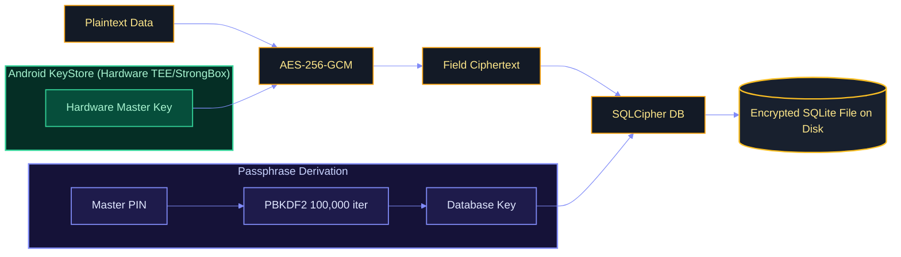
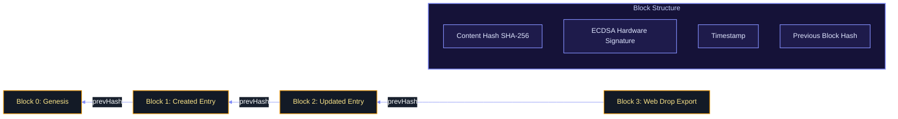
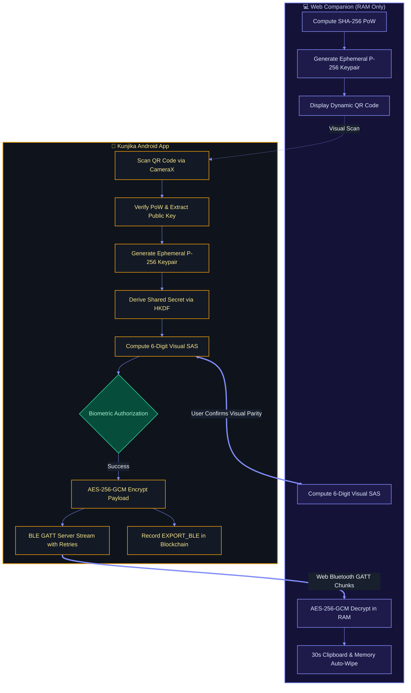

# 🛡️ Security Deep-Dive

Kunjika is engineered to exceed military-grade standards for local data protection. Operating on a **Zero-Network, Zero-Trust** model, it guarantees that credentials never touch the internet and are protected by hardware-backed cryptographic primitives.

---

## 🗝️ Encryption Strategy: "Double-Lock" Architecture

Kunjika does not simply encrypt the database file; it encrypts every sensitive field *before* it is written to an encrypted database.

> [!NOTE]
> **Double-Lock Protection**: Even if an attacker gains raw root access to the device and dumps the SQLite database file, the contents remain encrypted at the field level with a hardware-backed key that physically cannot be exported from the device's TEE or StrongBox.

### 1. Hardware Security Module (Android KeyStore)
All cryptographic keys are generated inside the device's **Trusted Execution Environment (TEE)** or dedicated **StrongBox Keymaster**:
- **Master Encryption Key**: AES-256-GCM key used for field-level credential encryption.
- **Identity Key**: Elliptic curve (`secp256r1`) key used for signing blockchain ledger blocks.
- **Biometric Key**: AES-256 key initialized with `setUserAuthenticationRequired(true)`.

### 2. Database Protection (SQLCipher)
- **PIN-Derived Database Passphrase**: The database encryption key is derived from the user's Master PIN combined with a per-device salt using **PBKDF2WithHmacSHA256** (100,000 iterations).
- **No Static Keys**: There are no hardcoded or static decryption keys anywhere in the application code.

---

## 🔐 Hardware-Bound Biometric PIN Storage

To provide frictionless biometric unlock without weakening the Master PIN or persisting plaintext credentials in storage or RAM:

1. **Hardware-Guarded Cipher**: When biometrics are enabled, an AES-256-GCM key is generated in the Android KeyStore requiring biometric authentication for each use (`setUserAuthenticationRequired(true)`).
2. **Cryptographic Wrapping**: Upon successful initial PIN entry and biometric verification, the Master PIN is encrypted using the authenticated `BiometricPrompt.CryptoObject` cipher.
3. **Persisting Encrypted Payload**: The resulting ciphertext and initialization vector (IV) are persisted in `UserPreferences`. Plaintext is cleared from memory.
4. **Biometric Unwrapping**: On subsequent app launches, a biometric prompt authorizes the KeyStore cipher to decrypt the stored PIN directly into volatile memory for database unlocking. If biometrics are modified or removed at the OS level, the KeyStore key is automatically invalidated by Android.

---

## 🧱 Local Blockchain Audit Log

To prevent offline modification attacks—where an attacker with physical or root access alters entries directly in the SQLite database file—Kunjika maintains a cryptographically signed blockchain ledger.

- **Content Hash**: `SHA-256` of the serialized transaction data.
- **Hardware Signature**: Signed with the device's private EC key (`secp256r1`) residing in the hardware TEE.
- **Cryptographic Chain**: Each block points to the previous block's SHA-256 hash. Any manual alteration of past database records breaks the cryptographic chain and triggers an immediate audit alert.

---

## 🛡️ Environmental Integrity & Tamper Protection

Kunjika incorporates multi-layered runtime environmental checks to detect compromised execution environments:

### 1. Real-Time Root Detection
- **Build Tags Analysis**: Scans `Build.TAGS` for `test-keys` indicative of custom, rooted ROMs.
- **System Binary Detection**: Probes filesystem paths for presence of the `su` binary across `/sbin/su`, `/system/bin/su`, `/system/xbin/su`, `/data/local/xbin/su`, `/system/sd/xbin/su`, and `/system/app/Superuser.apk`.
- **Runtime Execution Probe**: Spawns an isolated sub-process executing `which su` to catch stealth root managers that hide binaries from standard directory listings.

### 2. Emulator Environment Detection
Heuristic scanning flags emulated environments to prevent dynamic analysis in automated sandboxes:
- Checks build attributes for `generic`, `unknown`, `google_sdk`, `Android SDK built for x86`, and `vbox86p`.
- Inspects hardware configuration strings for `goldfish` and `ranchu` emulation architectures.
- Identifies virtualized manufacturers such as `Genymotion`.

### 3. KeyStore Hardware Attestation
- Uses `KeyInfo.isInsideSecureHardware` via `SecretKeyFactory` to verify whether the active encryption keys are physically backed by hardware (TEE/StrongBox) rather than a software fallback.

### 4. Google Play Integrity API
- Verifies app binary integrity and authentic signing certificates to prevent distribution of repackaged or trojanized APKs.

---

## 📂 Air-Gapped Web Drop Cryptographic Protocol

Web Drop enables wireless credential transfer to desktop/laptop browsers without internet access, third-party relays, or accounts.

### Cryptographic Guarantees:
1. **Client-Side Proof of Work (PoW)**:
   - Browser computes `SHA-256(SessionID + Nonce) < 0x0800...` before displaying the session QR code.
   - Sessions expire after 60 seconds, eliminating replay attacks.
2. **Ephemeral ECDH P-256 Key Agreement**:
   - Both devices generate single-use EC P-256 keypairs.
   - Android parses the browser's 65-byte uncompressed public key (`0x04 || X || Y`) and computes the Diffie-Hellman shared secret.
   - Keys are derived via **HKDF-SHA256** with domain separation context `"kunjika-web-drop-v1"`.
3. **Visual Short Authentication String (SAS)**:
   - To defeat Man-in-the-Middle (MitM) attacks over Bluetooth, both devices derive a 6-digit TOTP code from the shared secret.
   - User visually verifies code parity across both screens before touching the biometric sensor.
4. **Hardware Biometric Authorization**:
   - Android `BiometricPrompt` (`BIOMETRIC_STRONG`) must succeed before BLE advertising begins.
5. **BLE GATT Transfer with Reliable Chunking**:
   - Phone acts as a GATT peripheral server advertising Service `e9a30001-c852-4e08-9bfa-87bb0f592658`.
   - Transmits AES-256-GCM ciphertext in sequence-numbered chunks with notification retries for error-free delivery.
6. **RAM-Only Auto-Wipe**:
   - The Web Companion operates strictly in browser memory (no `localStorage`, cookies, or `IndexedDB`).
   - A 30-second countdown wipes decrypted credentials from RAM and shreds the OS clipboard.
7. **Blockchain Audit Trail**:
   - Every Web Drop transaction commits an `EXPORT_BLE` block into the local ledger.

---

## 📑 Backup Security & Cache Purging
- **Encrypted Vault Backups**: Password-protected vault exports encrypted with AES-256-GCM using PBKDF2 key derivation.
- **Cache Shredding**: Generated PDF Recovery Kits are automatically overwritten and purged from device cache immediately after sharing to leave zero filesystem footprint.
