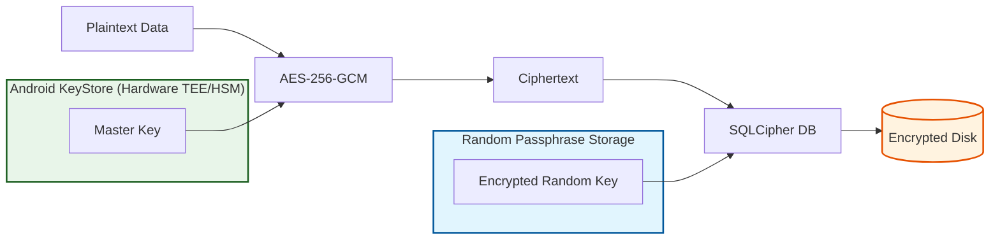
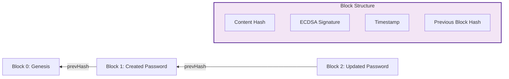
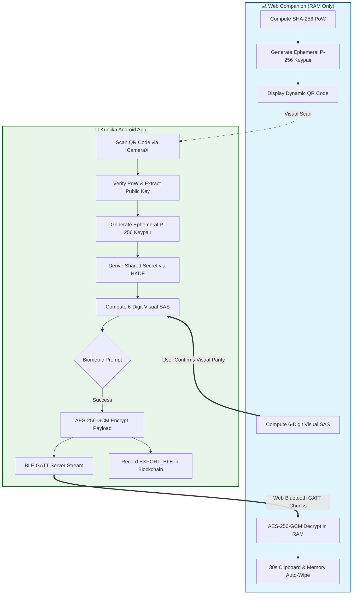

# 🛡️ Security Deep-Dive

Kunjika is engineered to exceed military-grade standards for local data protection. It operates on a **Zero-Network, Zero-Trust** model.

## 🗝️ Encryption Strategy: "Double-Lock" Architecture

Kunjika doesn't just encrypt the database; it encrypts the data *inside* the encrypted database.

> [!NOTE]
> **Double-Lock Architecture Explanation**: This diagram visualizes our "Double-Lock" security model. Plaintext data is first encrypted using **AES-256-GCM** with a master key from the **Android KeyStore** (TEE/HSM). The resulting ciphertext is then stored in a **SQLCipher Database**, which is itself locked with a unique random passphrase, providing two independent layers of hardware-backed protection.

### 1. The Hardware Layer (KeyStore)
Sensitive keys are generated inside the device's **Trusted Execution Environment (TEE)** or **Secure Element (SE)**. The private/secret keys never leave this hardware.
- **Master Key**: AES-256 for vault data.
- **Identity Key**: EC (secp256r1) for Blockchain signatures.
- **Biometric Key**: Requires `setUserAuthenticationRequired(true)`.

### 2. The Database Layer (SQLCipher)
- **Random Passphrase**: On first run, a 256-bit random key is generated.
- **Key Storage**: This key is encrypted by the Master Key and stored in DataStore.
- **SQLCipher**: The database is unlocked using this unique, non-deterministic key.

## 🧱 Local Blockchain Audit Log

To prevent "Offline Modification Attacks" (where an attacker with root access modifies the SQLite file directly), Kunjika maintains a cryptographically signed ledger.

> [!NOTE]
> **Blockchain Ledger Explanation**: The blockchain audit log creates a cryptographically linked chain of vault actions. Each block contains a **Content Hash** of the action, an **ECDSA Signature** from the hardware-backed Identity Key, and a **Merkle Link** (hash) to the previous block. This ensures that any manual tampering with the database file can be immediately detected.

## 🔐 Authentication & Access
- **Master PIN**: Protected via **PBKDF2WithHmacSHA256** with **100,000 iterations** and a unique 16-byte salt.
- **Biometric Binding**: Authentication is cryptographically bound to a KeyStore key. A UI-bypass (like Frida) cannot unlock the encryption without a hardware-verified biometric success.
- **Auto-Lock**: Foreground/Background lifecycle observers trigger an immediate vault lock.

## 📂 Secure Export & Sync

### 1. Phone-to-Phone QR Sync
- **Key Derivation**: PBKDF2 with 100,000 iterations derived from a randomly generated 6-digit Transfer Code.
- **Payload Encryption**: Authenticated AES-256-GCM.
- **Zero-Network**: Air-gapped visual transfer via camera and screen.

### 2. Air-Gapped Web Drop (Phone-to-PC Sync)
Web Drop enables wireless transfer of credentials directly to desktop/laptop browsers without internet access, third-party relays, or accounts.

#### Cryptographic Architecture & Guarantees:
- **Client-Side Proof of Work (PoW)**:
  - The browser calculates `SHA-256(SessionID + Nonce) < Target` (target prefix `< 0x0800...`) before rendering the QR code.
  - The Android app verifies the PoW difficulty before performing any cryptographic operations.
  - Sessions automatically renew every 60 seconds to prevent replay attacks and pre-computation.
- **Ephemeral ECDH P-256 Key Agreement**:
  - The Web Companion generates an in-memory EC P-256 keypair using the WebCrypto API.
  - The Android device generates its own ephemeral EC keypair, parses the uncompressed public key (65 bytes: `0x04 || X || Y`), and computes the Diffie-Hellman shared secret.
  - Shared keys are derived using HKDF-SHA256 with the domain separation string `"kunjika-web-drop-v1"`.
- **Short Authentication String (SAS) Verification**:
  - To prevent Man-in-the-Middle (MitM) attacks over the BLE airwaves, both devices compute a 6-digit visual code using `HMAC-SHA256` of the shared secret.
  - Both screens independently display this code. The user visually confirms that both numbers match before authorizing the transfer.
- **Biometric Hardware Authorization**:
  - Android `BiometricPrompt` (`BIOMETRIC_STRONG`) is required to authorize the BLE GATT advertising and transmission.
- **Direct Web Bluetooth (BLE GATT) Layer**:
  - The phone acts as a peripheral GATT server advertising Service `e9a30001-c852-4e08-9bfa-87bb0f592658`.
  - Payloads are chunked into 512-byte GATT notifications, carrying AES-256-GCM ciphertext, a 12-byte random IV, and a 16-byte authentication tag.
- **Zero Disk Persistence & RAM Auto-Wipe**:
  - The Web Companion stores zero data in `localStorage`, `sessionStorage`, `IndexedDB`, or cookies.
  - Upon user copy, a 30-second countdown is initiated, after which the browser wipes the credentials from RAM and clears the operating system clipboard.
- **Local Blockchain Audit Trail**:
  - Every Web Drop transfer is committed as an `EXPORT_BLE` block into the device's hardware-signed blockchain ledger.

### 3. Encrypted Backups & Cache Purge
- **Encrypted Backup**: AES-256-GCM vault backups with user-provided passphrases.
- **Cache Purge**: Recovery Kits (PDFs) are automatically shredded from device cache after sharing to prevent file system residue.
