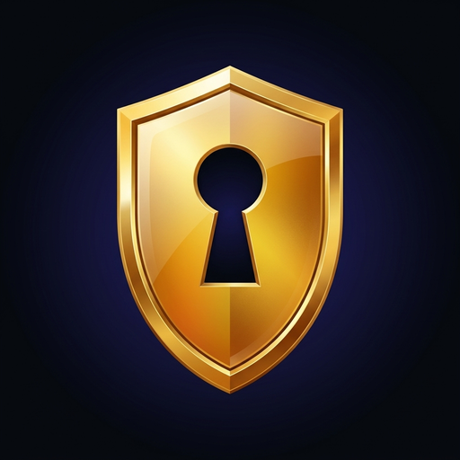
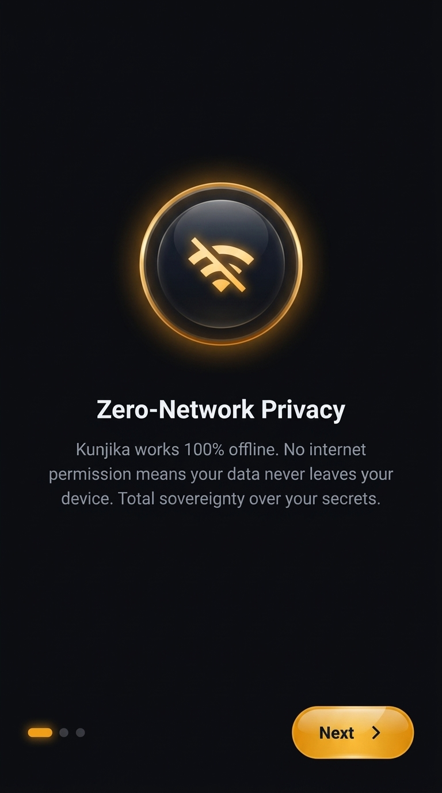
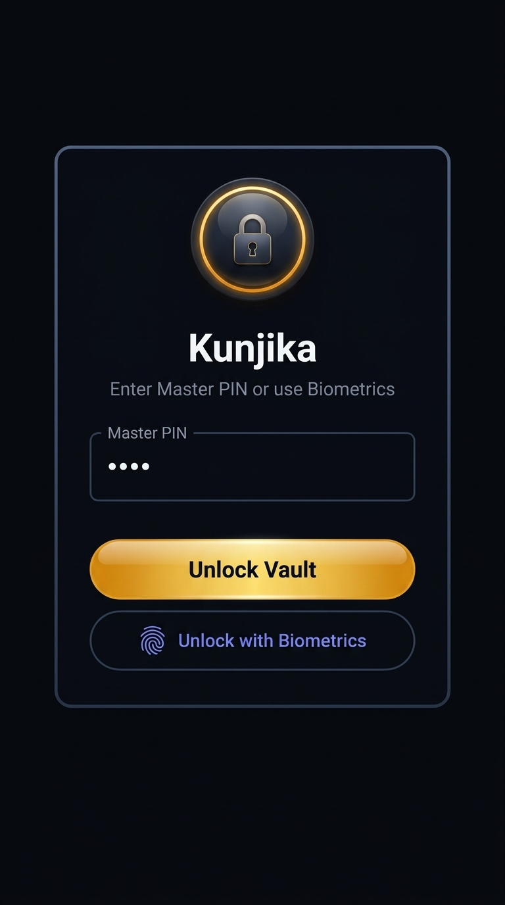
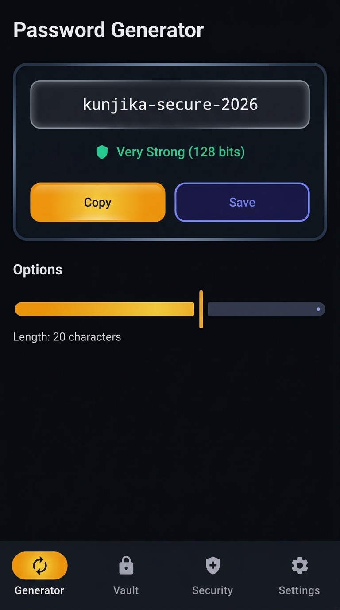
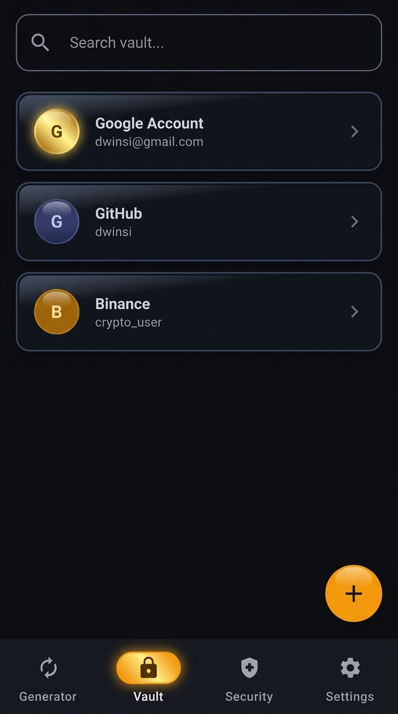
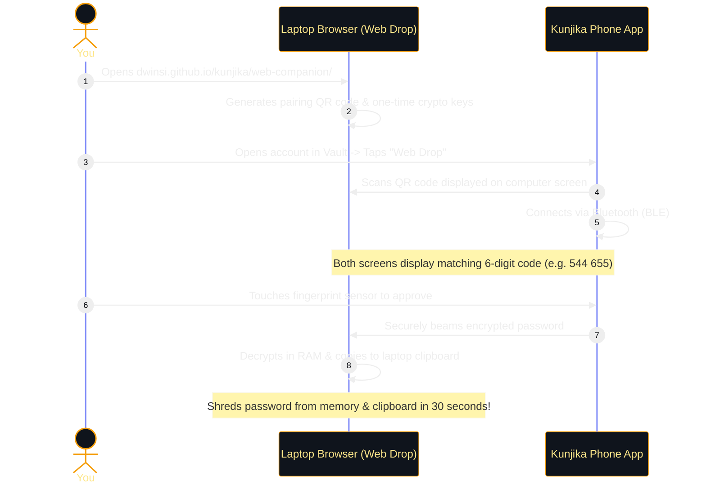

<div align="center">
  
  <h1>Kunjika User Guide & Quickstart</h1>
  <p><em>Zero-Network, Cryptographically Hardened Sovereign Password Vault for Android</em></p>
</div>

[](../RELEASE_NOTES.md)
[](security.md)
[](https://dwinsi.github.io/kunjika/web-companion/)

Welcome to **Kunjika**! If you are new to the app, this guide will help you understand how it works, how to set it up, and how to use all of its features in your day-to-day life.

---

## 📌 What is Kunjika? (In Simple Words)

Most password managers (like Chrome, LastPass, or 1Password) save your passwords on their cloud servers over the internet. If their servers ever get breached, your logins could be leaked.

**Kunjika is 100% offline.** 
- It does **not** have internet permission. It is physically impossible for Kunjika to send your data over the web.
- Your passwords are encrypted directly by your phone's physical security chip (Hardware TEE / StrongBox).
- **You** own the keys. No accounts to create, no monthly subscriptions, and zero tracking.

---

## 🚀 Quick Setup (First Launch)

When you open Kunjika for the first time, getting set up takes less than a minute.

| 1. Welcome Screen | 2. Master PIN & Biometrics |
| :---: | :---: |
|  |  |
| *Zero-network guarantee confirmation* | *Create your Master PIN and enable Fingerprint* |

### Step 1: Review Onboarding
Swipe through the quick onboarding screens explaining how Kunjika keeps your credentials safe offline.

### Step 2: Set Your Master PIN
- Pick a memorable 4 to 8-digit **Master PIN**. 
- Confirm your PIN.

> [!WARNING]
> **Keep your Master PIN safe!** Because Kunjika does not connect to any servers, there is no "Forgot Password" button. Nobody—not even the app developers—can recover your vault if you lose your Master PIN.

### Step 3: Enable Biometrics (Fingerprint / Face Unlock)
- Tap **Unlock with Biometrics** to link your fingerprint or face recognition.
- From now on, you can unlock your vault in less than a second with your fingerprint!

---

## 🧭 Navigating the App (The 4 Main Tabs)

At the bottom of your screen, you will find 4 main sections:

```
┌──────────────┬──────────────┬──────────────┬──────────────┐
│  🔄 Generator │   🔒 Vault   │  🛡️ Security │  ⚙️ Settings  │
└──────────────┴──────────────┴──────────────┴──────────────┘
```

1. **🔄 Generator**: Create super-strong passwords, memorable word passphrases, numeric PINs, and 2FA secrets.
2. **🔒 Vault**: Your encrypted safe where all your saved accounts, logins, and notes live.
3. **🛡️ Security**: A health dashboard that spots weak or reused passwords and checks your phone's safety.
4. **⚙️ Settings**: Change themes (Obsidian Gold or Platinum Silver), enable Android Autofill, and back up your vault.

---

## 💡 Common Use Cases & How to Use Them

---

### Use Case 1: Creating a Strong Password or Passphrase

Whenever you create a new account on a website or need to change an existing password, use the **Generator** tab.

<div align="center">
  
  <p><em>The Generator tab: real-time strength meter, slider, and quick Copy / Save buttons</em></p>
</div>

#### How to generate a password:
1. Tap the **Generator** tab at the bottom.
2. Choose your generation style:
   - **Password (Default)**: Random mix of letters, numbers, and symbols (e.g., `k8#Q!v9$L2z*M`).
   - **Passphrase (Diceware)**: Multiple easy-to-remember words separated by dashes (e.g., `correct-horse-battery-staple`).
   - **PIN**: Numeric passcode for bank cards or locks (e.g., `839201`).
   - **TOTP Secret**: Cryptographic secret keys for setting up two-factor authentication.
3. Adjust the **Length Slider** (we recommend at least 16–20 characters for passwords, or 4–5 words for passphrases).
4. Watch the **Strength Meter**: It will show whether the password is *Weak*, *Good*, or *Very Strong (128+ bits)*.
5. Tap **Copy** to paste it immediately into your browser or app, or tap **Save** to store it directly in your Kunjika Vault.

> [!TIP]
> **Need a previous password?** Scroll down to the **Generation History** card to find timestamped records of recently generated passwords.

---

### Use Case 2: Saving & Searching Your Logins in the Vault

Store your logins, usernames, passwords, and sensitive notes safely.

<div align="center">
  
  <p><em>The Vault tab: quick search, category filters, and one-tap access</em></p>
</div>

#### How to add a new account:
1. Tap the **Vault** tab at the bottom.
2. Tap the floating **`+` (Add)** button in the bottom right corner.
3. Fill in your account details:
   - **Title**: Service name (e.g., *Google*, *Amazon*, *Work Email*).
   - **Username / Email**: Your login ID.
   - **Password**: Type it or tap the dice icon to auto-generate a secure password.
   - **Category**: Group into *Personal*, *Work*, *Finance*, or *Social*.
   - **2FA Secret (Optional)**: If you want Kunjika to generate your rotating 6-digit authenticator codes.
   - **Notes (Optional)**: Any recovery codes or security questions (these are also encrypted).
4. Tap **Save**.

#### How to find and use a saved password:
- Use the **Search bar** at the top to type the name of the service.
- Tap the account card to open the **Details Dialog**.
- Tap the **Copy Password** button. For your privacy, the password is copied and your clipboard will automatically clear after a short timeout.

---

### Use Case 3: Using the Built-In 2FA Authenticator (TOTP)

You no longer need a separate app like Google Authenticator or Microsoft Authenticator!

1. When a website (e.g., GitHub, Google, Binance) asks you to set up Two-Factor Authentication (2FA), it provides a secret key (or text code).
2. Copy that secret key into the **TOTP Secret** field when creating or editing the entry in Kunjika.
3. Once saved, opening that item in Kunjika will display a live **6-digit code** with an animated countdown ring (refreshes every 30 seconds).
4. Tap the 6-digit code to copy it, then paste it into the website to verify your login!

---

### Use Case 4: Beaming Passwords to Your Computer with "Web Drop"

Ever get annoyed trying to manually type a 30-character password like `w9#mK$2P!v8xQ...` from your phone screen onto your laptop keyboard?

**Kunjika Web Drop** solves this problem instantly **without cables, without cloud accounts, and without Wi-Fi**:



#### Step-by-Step Instructions:
1. On your computer (Chrome, Edge, Brave, or Opera), open:  
   👉 **[https://dwinsi.github.io/kunjika/web-companion/](https://dwinsi.github.io/kunjika/web-companion/)**
2. On your phone, open Kunjika, tap the account you want to use, and tap **⚡ Web Drop**.
3. Point your phone camera at your computer screen to scan the QR code.
4. Verify that the **6-digit Pairing Code** shown on your phone matches the code on your laptop screen.
5. Touch your phone's fingerprint sensor to approve.
6. **Done!** The password is automatically copied to your computer's clipboard. Just press `Ctrl+V` (or `Cmd+V` on Mac) to log in!
7. After 30 seconds, the companion page automatically wipes the password from both your browser memory and clipboard for maximum safety.

---

### Use Case 5: Transferring Logins to Another Phone (Air-Gapped QR Transfer)

Bought a new phone or want to share a Wi-Fi or family password with another device? You can transfer it peer-to-peer using an encrypted QR code without using the cloud or sending text messages.

1. On **Phone A** (Sender):
   - Open the credential in your Vault.
   - Tap **Share via QR**.
   - Kunjika will encrypt the item with AES-256 and display a secure QR code along with a temporary **6-digit Transfer Code**.
2. On **Phone B** (Receiver):
   - Open Kunjika, go to Vault, and tap **Scan QR Import**.
   - Scan the QR code displayed on Phone A.
   - Enter the 6-digit Transfer Code to decrypt.
3. The account is instantly imported into Phone B's vault!

---

### Use Case 6: Checking Your Vault Health & Security Status

Tap the **🛡️ Security** tab to audit your passwords and device health:

- **Vault Hygiene**:
  - **Weak Passwords**: Flags passwords shorter than 12 characters.
  - **Reused Passwords**: Alerts you if the same password is used across multiple services (so a breach at one doesn't compromise the others).
  - **Aging Passwords**: Reminds you to rotate passwords that haven't been updated in over a year.
- **Device Environment Audit**:
  - Verifies that your phone is not running unauthorized root modifications or malicious malware debuggers.
  - Confirms hardware key attestation (confirming encryption keys are safely held in physical silicon).

---

### Use Case 7: Backing Up with an Emergency Recovery Kit

Because Kunjika is 100% offline, **you** are in control of your backups.

1. Go to the **⚙️ Settings** tab.
2. Tap **Emergency Recovery Kit**.
3. Authenticate with your fingerprint or Master PIN.
4. Kunjika generates an encrypted, formatted backup document.
5. You can print this out and store it in a physical safe, or save an encrypted backup file to an external USB drive.

---

### Use Case 8: Enabling Android Autofill

Tired of copying and pasting? Let Android fill your logins automatically:

1. Open Kunjika and go to **⚙️ Settings**.
2. Tap **Autofill Service**.
3. Select **Kunjika** as your default autofill provider in Android Settings.
4. Next time you open an app or website login form, tap the password box and choose Kunjika to unlock with your fingerprint and fill your credentials with a single tap!

---

## ❓ Frequently Asked Questions (FAQ)

### Q: Does Kunjika ever send my data to the internet?
**No, never.** Kunjika does not even have the Android Internet permission (`android.permission.INTERNET`) declared in its manifest. Even if someone tried to add tracking code, the Android operating system would physically block any network request.

### Q: What happens if I forget my Master PIN?
Because Kunjika is a zero-knowledge, sovereign vault, your Master PIN is the cryptographic key that decrypts your database. No one can reset it for you. We strongly advise printing an **Emergency Recovery Kit** from the Settings tab when you first set up the app.

### Q: Why can't I take screenshots inside the app?
Kunjika enables Android's `FLAG_SECURE` protection throughout the app. This prevents spyware, malware, or background apps from capturing your screen, and keeps your sensitive information hidden when you view recent apps in Android's task switcher.

### Q: What browsers work with Web Drop?
Web Drop uses the Web Bluetooth standard, which is natively supported in **Google Chrome**, **Microsoft Edge**, **Brave**, and **Opera** on Windows, macOS, Linux, and ChromeOS.

---

## 📚 Need More Technical Details?

For engineers, security auditors, or curious minds:
- **[🏗️ Technical Architecture](architecture.md)** — MVVM structure, KeyStore TEE, and GATT Bluetooth protocol.
- **[🛡️ Cryptographic Security Deep-Dive](security.md)** — Double-Lock encryption, PBKDF2 parameters, and local blockchain audit log.
- **[✨ Full Feature Specifications](features.md)** — Exhaustive list of all app specifications and configurations.
